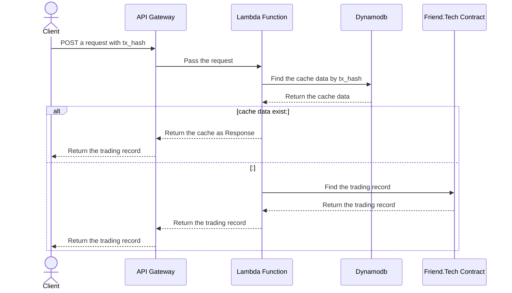

# friend-tech-trade-query-api

## Requirement

1. As a user I need a function to query the Friend.Tech trading record from web3.

2. To reduce the latency of response, the function need to store data in the cache. 

## Request
```cmd
curl --location 'https://lnirbq5gi0.execute-api.ap-northeast-1.amazonaws.com/query' \
    --header 'Content-Type: application/json' \
    --data '{
        "tx_hash": "0xc3100e7e0bb4f89f91d2d9da6636689601f4447423562e1910e8668a5b78a987"
    }'
```

## Response 
```json
{
    "trader": "0x2B5AB508DffC087232f4df475aE29c4B7a6Aa918",
    "subject": "0x2Ff20e30D147de328a7Af12CE2c7F2520207805e",
    "share_amount": "1",
    "eth_amount": "2250000000000000",
    "protocol_eth_amount": "112500000000000",
    "subject_eth_amount": "112500000000000",
    "supply": "6"
}
```

## Sequence

